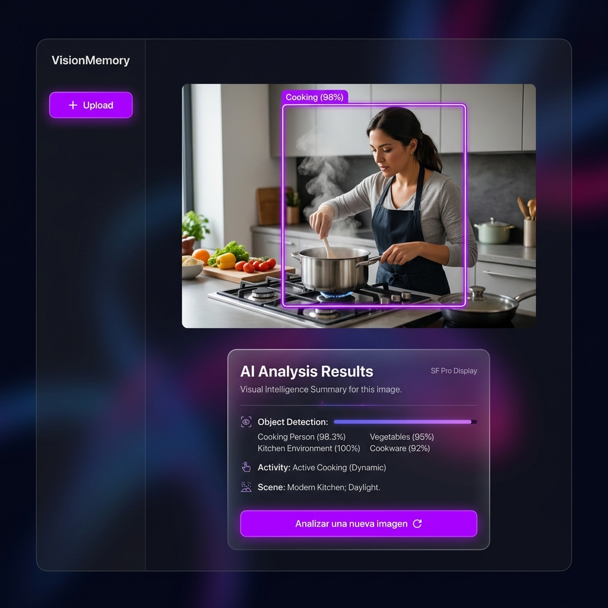

<p align="center">
  
</p>

<h1 align="center">🧠 VisionMemory</h1>

<p align="center">
  <em>Una aplicación full-stack de <strong>análisis visual con memoria persistente</strong>. Sube imágenes, identifica objetos con <strong>YOLOv8</strong>, analiza escenas con un <strong>modelo de visión local</strong> (Ollama) y construye una base de conocimiento que se enriquece con cada nueva imagen.</em>
</p>

<p align="center">
  
  
  
  
  
  
  
  
  
  
</p>

---

## ✨ Características Principales

| | Característica | Descripción |
|---|---|---|
| 🔍 | **Detección de objetos con YOLOv8** | Identifica automáticamente personas, animales, vehículos y 80+ categorías de objetos con bounding boxes y porcentaje de confianza. |
| 👁️ | **Análisis visual con IA local** | Utiliza [Ollama](https://ollama.com/) con `llama3.2-vision` para **ver** y describir el contenido real de las imágenes — ropa, expresiones, entorno, actividades. |
| 🧠 | **Memoria persistente** | Cada análisis alimenta una base de conocimiento en MongoDB. Cuando el sistema vuelve a detectar un objeto ya conocido, incorpora observaciones previas al análisis. |
| 📊 | **Historial de análisis** | Consulta todos los análisis pasados con vista paginada: thumbnail, etiquetas detectadas, resumen y timestamp. |
| 🏷️ | **Etiquetas co-ocurrentes** | El sistema aprende qué objetos suelen aparecer juntos y lo registra como `relatedLabels`. |
| 🎯 | **Bounding boxes interactivos** | Las detecciones se dibujan en un canvas HTML5 sobre la imagen original con etiqueta y confianza. |
| ✅ | **Indicador "Memory used"** | Badge visual que indica si el análisis se enriqueció con conocimiento acumulado de análisis previos. |
| 🔒 | **Privacidad total** | Sin API keys, sin cuentas, sin envío de datos a la nube. Todo funciona en local. |


## 🛠️ Stack Tecnológico

| Capa | Tecnologías |
|---|---|
| **Frontend** | React 18, Vite 6, Tailwind CSS 3, TypeScript, Lucide Icons, Axios |
| **Backend** | Node.js 18+, Express 4, Mongoose 8, Multer, TypeScript |
| **IA** | Python 3.11+, FastAPI, Ultralytics (YOLOv8n), httpx, pymongo |
| **LLM** | Ollama (llama3.2-vision) — modelo de visión local |
| **Base de datos** | MongoDB (Docker) |

---

## 🚀 Guía de Inicio Rápido

### Prerrequisitos

- **Node.js** 18+
- **Python** 3.11+
- **Docker** (o MongoDB instalado localmente)
- **[Ollama](https://ollama.com/)** instalado en tu sistema

### 1️⃣ Iniciar Ollama y descargar el modelo de visión

```bash
ollama pull llama3.2-vision
ollama serve
```

### 2️⃣ Base de datos (MongoDB con Docker)

```bash
docker compose up -d
```

### 3️⃣ Backend (Express)

```bash
cd server
cp ../.env.example .env
npm install
npm run dev
```

> El servidor arrancará en `http://localhost:5000`

### 4️⃣ Servicio IA (FastAPI)

```bash
cd ai-service

# Crear entorno virtual
py -m venv .venv              # Windows
# python3 -m venv .venv       # Linux/Mac

# Activar entorno virtual
.venv\Scripts\activate        # Windows
# source .venv/bin/activate   # Linux/Mac

pip install -r requirements.txt
uvicorn app.main:app --reload --port 8000
```

> El servicio IA estará en `http://localhost:8000`

> **Nota:** La primera ejecución descargará automáticamente los pesos del modelo YOLOv8n (~6 MB).

### 5️⃣ Frontend (Vite + React)

```bash
cd client
npm install
npm run dev
```

> Abre **http://localhost:5173** en tu navegador 🎉

---

## 📁 Estructura del Proyecto

```
VisionMemory/
├── client/                    # Frontend React + TypeScript
│   └── src/
│       ├── components/        # Navbar, ImageCanvas
│       ├── pages/             # UploadPage, HistoryPage, MemoryPage
│       ├── context/           # AppContext (estado global)
│       └── utils/             # API client (Axios)
├── server/                    # Backend Node.js + TypeScript
│   └── src/
│       ├── routes/            # analyze, analyses, memory
│       ├── models/            # Analysis.ts, MemoryEntry.ts
│       └── services/          # aiService.ts (comunicación con FastAPI)
├── ai-service/                # Microservicio Python IA
│   └── app/
│       ├── main.py            # FastAPI endpoints
│       ├── detector.py        # Wrapper YOLOv8n
│       ├── memory.py          # Consultas MongoDB vía pymongo
│       └── ollama_client.py   # Comunicación con Ollama (visión)
├── uploads/                   # Imágenes subidas
├── docker-compose.yml         # MongoDB
├── .env.example               # Plantilla de variables de entorno
└── README.md
```

---

## 🔌 API Endpoints

| Método | Ruta | Descripción |
|---|---|---|
| `POST` | `/api/analyze` | Sube una imagen, ejecuta el pipeline completo y devuelve el análisis |
| `GET` | `/api/analyses?page=&limit=` | Lista todos los análisis pasados (paginado) |
| `GET` | `/api/analyses/:id` | Detalle de un análisis específico |
| `GET` | `/api/memory` | Lista todos los documentos MemoryEntry |
| `GET` | `/api/memory/:label` | Memoria para una etiqueta específica |
| `DELETE` | `/api/memory/:label` | Elimina la memoria de una etiqueta |

---

## 🔒 Seguridad y Privacidad

- ✅ **Sin API keys ni tokens** — YOLOv8 y Ollama se ejecutan localmente.
- ✅ **IA 100% local** — Ollama se ejecuta en tu máquina, tus imágenes nunca salen de tu equipo.
- ✅ **`.env` excluido del repositorio** — El `.gitignore` protege cualquier variable sensible.
- ✅ **Sin datos personales expuestos** — Todo el procesamiento ocurre en tu máquina.

---

## 🤖 ¿Cómo funciona la Memoria Visual?

VisionMemory no es un analizador de imágenes genérico. Cada vez que subes una imagen:

1. **YOLOv8n** detecta los objetos presentes (personas, coches, perros, etc.) con coordenadas y confianza.
2. El sistema consulta MongoDB buscando **memoria previa** sobre esos objetos.
3. Se construye un `prompt` que combina: la imagen real + las detecciones + el contexto acumulado.
4. **Ollama (llama3.2-vision)** recibe la imagen directamente y genera un análisis visual detallado.
5. El resultado se guarda y la memoria se actualiza: incrementa contadores, añade observaciones y registra etiquetas co-ocurrentes.

Esto permite que el sistema **aprenda y mejore** con cada imagen:
- *"He visto 'persona' 15 veces, frecuentemente junto a 'coche' y 'mochila'"*
- *"Observaciones previas: persona con uniforme de chef, persona corriendo en un parque..."*

---

## 📄 Licencia

Este proyecto está bajo licencia **MIT**.

---

<p align="center">
  Hecho con ❤️ por <a href="https://www.linkedin.com/in/ignacio-fernandez-clemente-vazquez/">ifcv</a>
</p>
